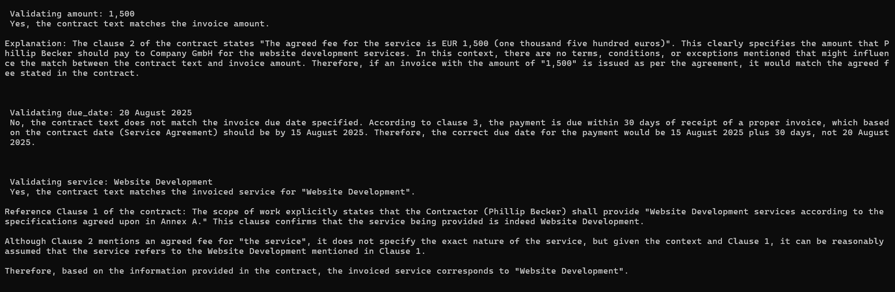

# Invoice Contract Validator (RAG + LLM)

## Overview
This application compares an invoice against a contract and checks whether the values (due date, amount, service) match the agreed terms using Retrieval-Augmented Generation and a local LLM ( via Ollama - Mistral).

## Technical Details
- **LLM**: [Ollama](https://ollama.com) running the **Mistral** model locally
- **Vector Store**: ChromaDB
- **Embeddings**: Sentence Transformers (`all-MiniLM-L6-v2`)
- **PDF Parsing**: pdfplumber
- **Language**: Python 3.x
- **Interface**: Command Line (CLI)

## Installation
```bash
git clone <this-repo>
cd invoice-contract-validator
python -m venv venv
source venv/bin/activate
pip install -r requirements.txt
```

## Running the application
Ensure Ollama is running and model (mistral) is available:
```bash
ollama run mistral
python app.py
```

## Input Files
Put your PDFs into the `data/` folder:
- `contract.pdf`
- `invoice.pdf`

## Output
For each invoice field (amount, due date, service), it will:
- Retrieve relevant contract text
- Use LLM to verify if it matches and give the justification for the result

Below is an example of the validation results (2 yes, 1 no) when running the project:
- Amount match
- Date mis-match
- Service match


---
